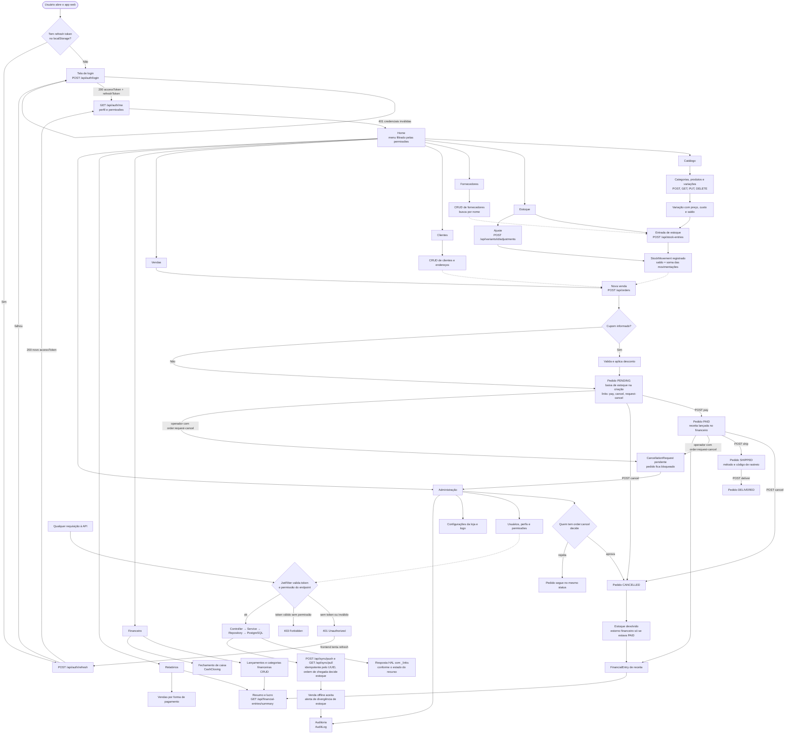

# Fluxo completo do app

```mermaid
flowchart TD
    Start([Usuário abre o app web]) --> HasSession{"Tem refresh token<br/>no localStorage?"}
    HasSession -- Não --> Login["Tela de login<br/>POST /api/auth/login"]
    HasSession -- Sim --> Refresh["POST /api/auth/refresh"]
    Refresh -- falhou --> Login
    Login -- "401 credenciais inválidas" --> Login
    Login -- "200 accessToken + refreshToken" --> Me["GET /api/auth/me<br/>perfil e permissões"]
    Refresh -- "200 novo accessToken" --> Me
    Me --> Home["Home<br/>menu filtrado pelas permissões"]

    Home --> Catalog["Catálogo"]
    Home --> Stock["Estoque"]
    Home --> Suppliers["Fornecedores"]
    Home --> Customers["Clientes"]
    Home --> Sales["Vendas"]
    Home --> Finance["Financeiro"]
    Home --> Reports["Relatórios"]
    Home --> Admin["Administração"]

    Catalog --> CatCrud["Categorias, produtos e variações<br/>POST, GET, PUT, DELETE"]
    CatCrud --> VariantOk["Variação com preço, custo e saldo"]

    Suppliers --> SupCrud["CRUD de fornecedores<br/>busca por nome"]

    Stock --> StockIn["Entrada de estoque<br/>POST /api/stock-entries"]
    Stock --> StockAdj["Ajuste<br/>POST /api/variants/id/adjustments"]
    SupCrud -.-> StockIn
    VariantOk --> StockIn
    StockIn --> Movement["StockMovement registrado<br/>saldo = soma das movimentações"]
    StockAdj --> Movement

    Customers --> CustCrud["CRUD de clientes e endereços"]

    Sales --> NewSale["Nova venda<br/>POST /api/orders"]
    CustCrud -.-> NewSale
    Movement -.-> NewSale
    NewSale --> Coupon{"Cupom informado?"}
    Coupon -- Sim --> ValidateCoupon["Valida e aplica desconto"]
    Coupon -- Não --> Pending
    ValidateCoupon --> Pending["Pedido PENDING<br/>baixa de estoque na criação<br/>links: pay, cancel, request-cancel"]

    Pending -- "POST pay" --> Paid["Pedido PAID<br/>receita lançada no financeiro"]
    Pending -- "POST cancel" --> Cancelled["Pedido CANCELLED"]
    Paid -- "POST cancel" --> Cancelled
    Paid -- "POST ship" --> Shipped["Pedido SHIPPED<br/>método e código de rastreio"]
    Shipped -- "POST deliver" --> Delivered["Pedido DELIVERED"]
    Pending -- "operador com order:request-cancel" --> CancelReq["CancellationRequest pendente<br/>pedido fica bloqueado"]
    Paid -- "operador com order:request-cancel" --> CancelReq
    CancelReq --> Admin
    Admin --> Approve{"Quem tem order:cancel<br/>decide"}
    Approve -- aprova --> Cancelled
    Approve -- rejeita --> Unblocked["Pedido segue no mesmo status"]
    Cancelled --> Reversal["Estoque devolvido<br/>estorno financeiro só se estava PAID"]

    Paid --> FinEntry["FinancialEntry de receita"]
    Reversal --> FinEntry
    Finance --> EntryCrud["Lançamentos e categorias financeiras<br/>CRUD"]
    Finance --> Closing["Fechamento de caixa<br/>CashClosing"]
    FinEntry --> Summary["Resumo e lucro<br/>GET /api/financial-entries/summary"]
    EntryCrud --> Summary
    Reports --> Summary
    Reports --> ByPayment["Vendas por forma de pagamento"]

    Admin --> Users["Usuários, perfis e permissões"]
    Admin --> Settings["Configurações da loja e logo"]
    Admin --> Audit["Auditoria<br/>AuditLog"]

    Users -.-> Permission
    Request["Qualquer requisição à API"] --> Permission{"JwtFilter valida token<br/>e permissão do endpoint"}
    Permission -- "sem token ou inválido" --> E401["401 Unauthorized"]
    Permission -- "token válido sem permissão" --> E403["403 Forbidden"]
    Permission -- ok --> Handler["Controller → Service → Repository → PostgreSQL"]
    Handler --> Hal["Resposta HAL com _links<br/>conforme o estado do recurso"]
    E401 -- "frontend tenta refresh" --> Refresh

    Handler --> Sync["POST /api/sync/push e GET /api/sync/pull<br/>idempotente pelo UUID, ordem de chegada decide estoque"]
    Sync --> Divergence["Venda offline aceita<br/>alerta de divergência de estoque"]
    Divergence --> Audit
```
